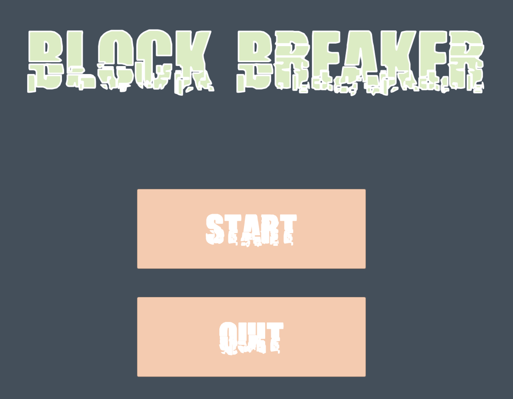
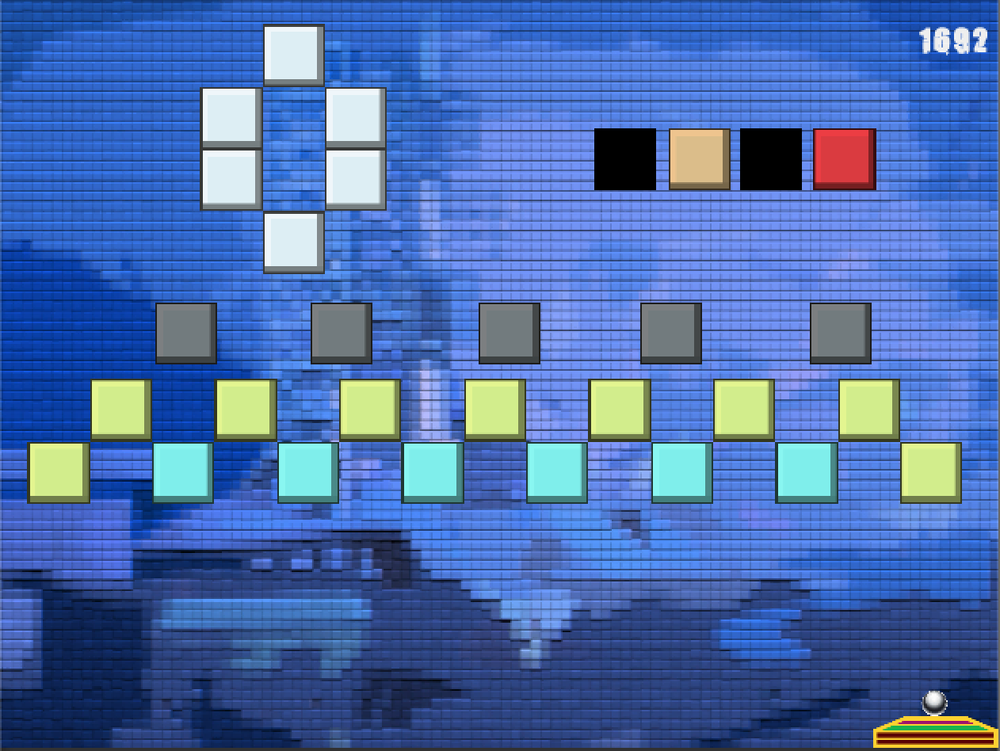
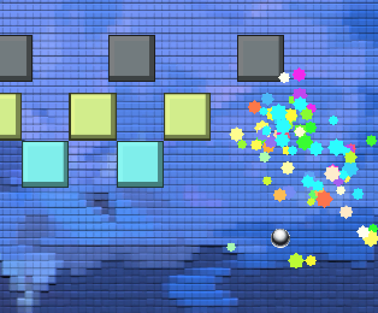
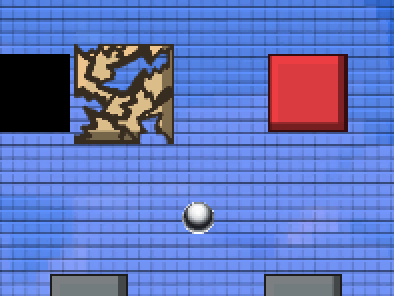

# unity-block-breaker

Shawnkoon version of popular block breaker game built with Unity.

## **Can you beat all 4 levels?**

## Requirements

- Please install Mono with version `5.10.x` or higher.
- Game was designed using unity version `2018.2.16f1`.

## Game

### About
> Traditional block breaker game but coded/designed in my own way under guidance of tutorial.

### GamePlay
> Move the mouse to move `Paddal` around the screen and click to shoot the ball to start the game. Player's goal is to break all of the **breakable** blocks to advance to a next level and get Higher score.

### GamePlay

## Credits

- Game was designed by [Tutorial](https://www.udemy.com/unitycourse/) on Udemy.
- Sprite assets are distributed by `Rick Davidson`.
- Audio assets are distributed by `Rick Davidson`.
